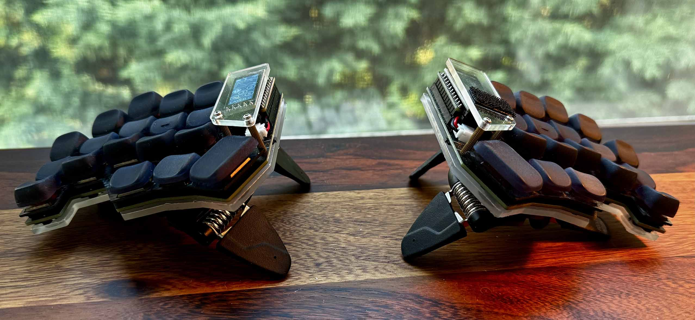

# Chocofi 3D

- [Chocofi split keyboard](https://github.com/pashutk/chocofi) from [beekeeb](https://shop.beekeeb.com/product/chocofi-36-keys-kailh-low-profile-choc-v1-mechanical-ergonomic-hotswap-split-keyboard-diy-kit)
- [nice!nano boards](https://nicekeyboards.com/nice-nano) and [nice!view displays](https://nicekeyboards.com/nice-view)
- [Sunset tactile Choc switches](https://lowprokb.ca/products/sunset-tactile-choc-switches)
- [KLP Lamé Choc sculpted keycaps](https://github.com/braindefender/KLP-Lame-Keycaps/) from [3dkeycap](https://3dkeycap.com/collections/split-keyboards/products/klp-choc-keycap-set-low-profile-ergonomic-sculpted-keycaps)
- [Manfrotto MP3-BK Pocket Support tripods](https://www.manfrotto.com/us-en/pocket-support-large-black-mp3-bk)
- [Moment Multi-Threaded Mount for MagSafe](https://www.shopmoment.com/products/multi-thread-mount-for-magsafe-1)
- [Scosche MPLTMSPCH MagicRing MagSafe adapter](https://www.scosche.com/magicring-adhesive-magsafe-ring-2pack)
